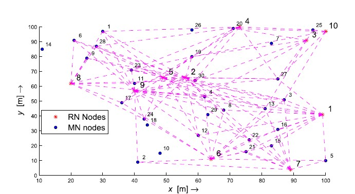
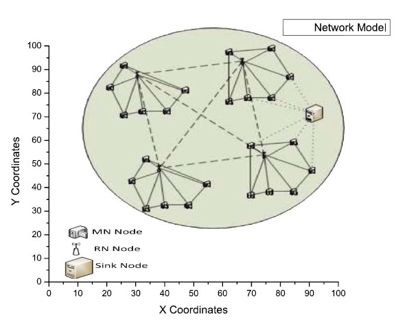
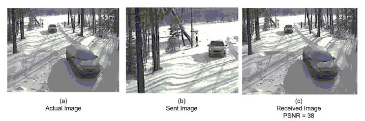

# Energy-Efficient-Object-Detection-and-Image-Transmission-in-WMSN

     

   
 
  

 
  <a href ="https://ieeexplore.ieee.org/abstract/document/7482640"> Paper</a> | 
  <a href="https://www.researchgate.net/publication/303770986_A_Novel_Energy_Efficient_Object_Detection_and_Image_Transmission_Approach_for_Wireless_Multimedia_Sensor_Networks"> Preprint </a>
  

  This is the official repository of our paper <b>A Novel Energy Efficient Object Detection and Image Transmission Approach for Wireless Multimedia Sensor Networks</b> 

 The present code is written in MATLAB version (2011). In future, the code will be converted to python for inter-platform compatibility.
  

<h2> News> </h2>
<ul>
  <li>[April 18, 2021] Created a repository for the paper</li>
  </ul>

<h2> Collaborations </h2>

Collaborations are welcomed 

<h2> Citation </h2>

 If you are using this code or any part of the publication, please consider to cite

 <code> Rehman, Y.A.U., Tariq, M. and Sato, T., 2016. A novel energy efficient object detection and image transmission approach for wireless multimedia sensor networks. IEEE sensors journal, 16(15), pp.5942-5949.</code>  

<h2> Contact </h2>

 This project is currently mantained by Yasar Abbas Ur Rehman <a href="https://github.com/yasar-rehman"> @yasar-rehman </a>

 If you have any questions, feel free to contact at <code>yasir.abbas42@gmail.com</code> 

